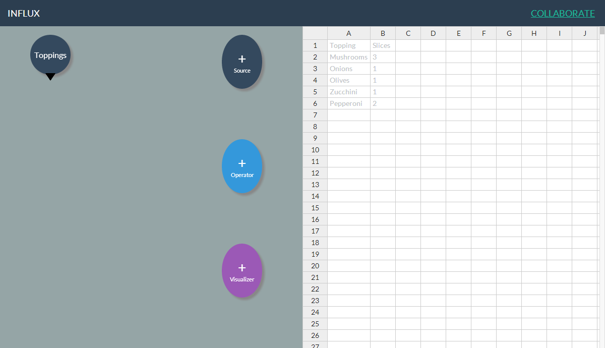
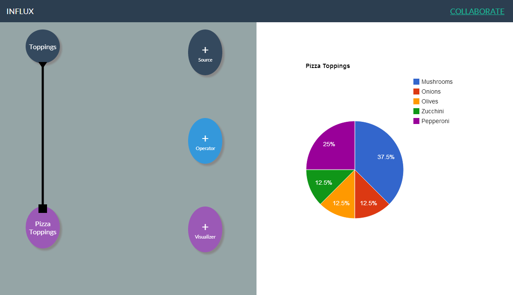
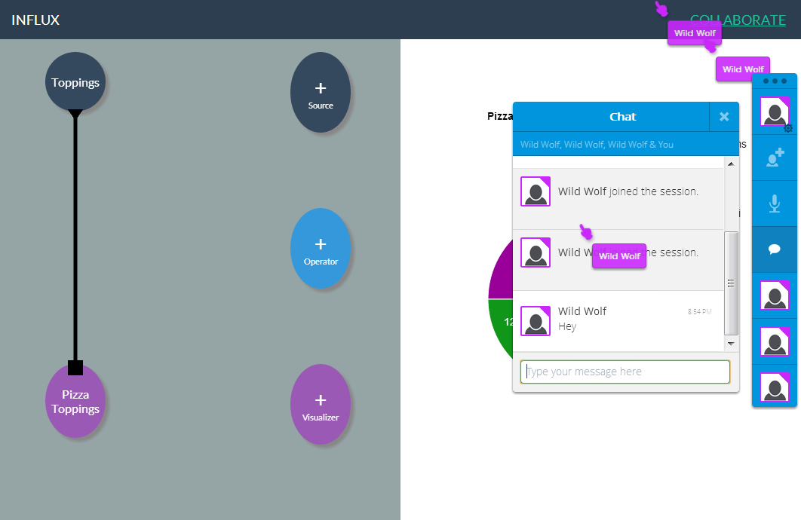
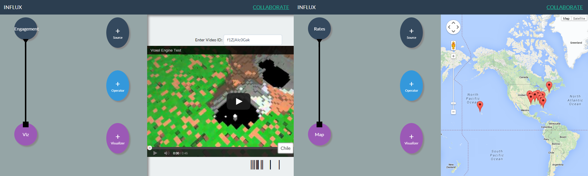
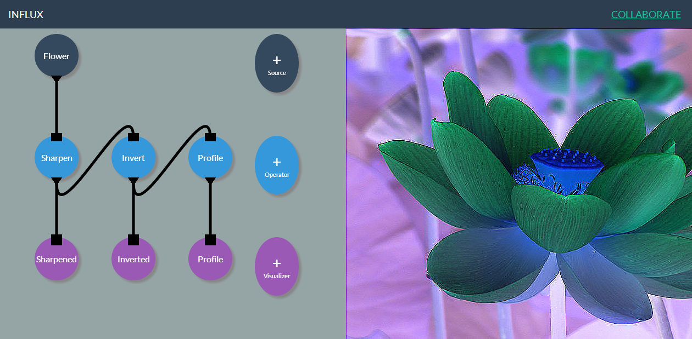

# Influx (Prototype)
## Created in 24 Hours for the Stanford ACM 2014 Winter Hackathon (3rd Place)

Influx is a abstract tool for creating data analysis pipelines. In very basic sense, this let's you create sources, transform that data through operators, and display it in some visualizer.

Let's look at a basic example. Here I have a `Table` source, which has data for Pizza toppings.



I can connect that to a `Pie Chart` visualizer, and see the results as a Pie chart. The same `Table` source can be connected to a `Bar Chart` visualizer, and work just as well.



Influx also has rudimentary support for real-time collaboration with any number of users, with audio chat, using a library called Together.JS. Work-spaces are persisted using Azure Mobile Services.



With Influx, you can develop visualizers that closely correlate to the type of data that they represent. `Video Engagement` and `Google Maps` visualizers are shown below.



The data model in Influx is abstract enough to be used even for image processing.



The example below shows an operator with settings. This operator takes sensor data measured on 15 minute intervals, and collapses it into intervals of 60 minutes.


## Setting up
Create a file called env.js in the top directory, with the following format.
```javscript
ENV = {
	"AZURE_APP_KEY" : "Your azure mobile data key.",
	"APP_URL" : "Your azure app URL."
}
```
